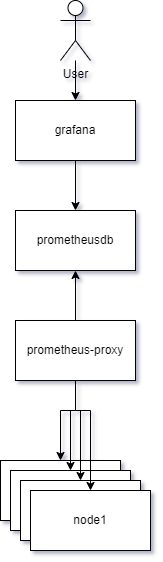

# Comparing Patterns of Distributed Data Collection

## Premise

Big data collection is a solved problem in web technology, albeit still expensive due to the cost of storing long term data. In these examples, the utilization is the same: Grafana dashboards are used to query and alert based on data collected by each system.

This is not a comprehensive example, nor does it list all technologies that compete in this space. It is simply comparing two that were brought up in conversation and serve as an example of the patterns themselves.

## Navigation

* [Prometheus Lab Guide](./prom-snmp-stack/README.md)
* [Influx Lab Guide](./tig-stack/README.md)

## Telegraf (Distributed configuration/Push pattern)

Where Telegraf & the corresponding TIG stack isn't necessary ALWAYS a distributed agent network, and it's not always pushing metrics to a central DB, the example here is just that. 

Each node container is configured to generate random values, and push it to a single known database. The database has a username & password to prevent miscellaneous data sources, but other than that: Any device that knows the right endpoint simply need to ship metrics to it. 

This uses Telegraf as the mechanism to execute our [data collection script](./tig-stack/telegraf/scripts/randmetrics.sh), which will collate the raw metrics in its simplest form and push it to it's configured output db [influxdb](./tig-stack/influxdb/).

### Pros

Configuration of this model is done at creation time and does not need further modification at any central point. This can greatly simplify deployment. Telegraf in this case also provides a very simple interface between "get metrics" and "deliver metrics" in a single sweep. 

### Cons

After deployment, these still need to be modified and inventoried. Products like Ansible can solve this problem, but can introduce complexity later in the lifecycle of the product.

## SNMP (Centralized configuration)

SNMP was created in 1988 to manage many many devices at once with very low overhead. Today it's largely used for networking equipment or underpowered devices like IOT functions and has been greatly displaced by the ever-cheaper compute power available today.

Here we defined a custom [SNMP OID](./prom-snmp-stack/snmp/node1/config/snmpd.conf) with which to monitor our [custom resource collector](prom-snmp-stack/snmp/scripts/randmetrics.sh) that is defined by our central collector as [a custom model](prom-snmp-stack/prometheus-proxy/config/snmp.yml).

### Pros

Many pre-made products already support SNMP and have well defined documentation to access the juicy details there-in.

### Cons

SNMP requires extrenuous research and testing for even the simplest metrics collections due to its long list of [opinions](https://stackoverflow.com/questions/802050/what-is-opinionated-software) and baked-in assumptions. 
